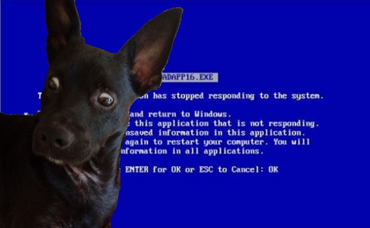

<h2>Bem-vindo ao meu GitHub👋</h2>

----------------------

👽 Me chamo Caio Cristhyan

💬 Trabalho como desenvolvedor de sistemas no Banco do Estado do Rio Grande do Sul - Banrisul

🔭 Formado em tecnologia em ciência de dados e bacharel em ciência e tecnologia

🌱 Atualmente estou estudando DevOps

📫 [LinkedIn](https://www.linkedin.com/in/caiocristhyan/)

----------------------
### Linguagens 

----------------------
### Versionamento 

----------------------
### Linguagens 
<!--
**caiocristhyan/caiocristhyan** is a ✨ _special_ ✨ repository because its `README.md` (this file) appears on your GitHub profile.

Here are some ideas to get you started:

- 🔭 I’m currently working on ...
- 🌱 I’m currently learning ...
- 👯 I’m looking to collaborate on ...
- 🤔 I’m looking for help with ...
- 💬 Ask me about ...
- 📫 How to reach me: ...
- 😄 Pronouns: ...
- ⚡ Fun fact: ...
-->
